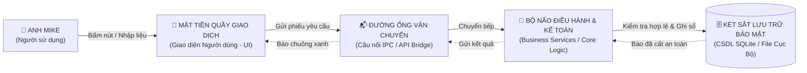

# BẢN VẼ KHÁI QUÁT KIẾN TRÚC & CƠ CHẾ VẬN HÀNH
*(Phong cách bình dân học vụ — Dành cho người không cần biết code)*
*Dự án: 03. LAB 03 - Web ban Da Tu Nhien*  
*Kiến trúc sư trưởng:* **Anh Mike (Mike Lam)**  
*Cộng sự Kỹ thuật AI:* **Antigravity (Gemini)**  
*Loại ứng dụng (App Type):* `Desktop/Electron`

---

## 1. ẨN DỤ ĐỜI THỰC: SẢN PHẨM HOẠT ĐỘNG GIỐNG NHƯ THẾ NÀO?

Để dễ hình dung nhất mà không cần một dòng mã nguồn nào, hãy tưởng tượng toàn bộ hệ thống phần mềm này vận hành chính xác như một **Ngân hàng Giao dịch Hiện đại**:

1. **🏪 Mặt tiền quầy giao dịch (Giao diện người dùng — UI):**
   - Là những gì hiển thị trên màn hình trước mắt Anh Mike: các nút bấm, ô điền chữ, bảng biểu danh sách hồ sơ.
   - Nhiệm vụ: Đón nhận thao tác của Anh, gom thông tin vào một "phiếu yêu cầu" và đưa mắt nhìn kết quả. Nó **không tự ý quyết định đúng sai hay cất tiền**, mà chỉ làm nhiệm vụ tiếp tân.

2. **📬 Đường ống vận chuyển an toàn (Cầu nối IPC / API Bridge):**
   - Là chiếc ống truyền tin hai chiều bọc thép nối giữa quầy tiếp tân và phòng kế toán bên trong.
   - Mọi thông tin gửi qua đây đều được đóng gói chuẩn một định dạng duy nhất gọi là `ApiResult`: *Luôn có nhãn báo thành công hay thất bại, nếu thất bại thì có câu giải thích bằng tiếng Việt.*

3. **🧠 Bộ não điều hành & Kế toán trưởng (Core Logic / Backend):**
   - Nằm kín đáo phía sau, không ai nhìn thấy trực tiếp.
   - Nhiệm vụ: Soát xét mọi điều kiện nghiệp vụ: *Mã này có bị trùng không? Số tiền có bị âm không? Công thức tính nhân chia diện tích có chuẩn không?* Nếu phát hiện bất thường, kế toán lập tức từ chối và trả thông báo lỗi ra quầy tiếp tân.

4. **🗄️ Két sắt lưu trữ bảo mật (Cơ sở dữ liệu SQLite / Local DB):**
   - Là chiếc két sắt vững chắc nằm ngay trên ổ cứng máy tính của Anh.
   - Nhiệm vụ: Cất giữ toàn bộ hồ sơ, dữ liệu lịch sử một cách an toàn vĩnh viễn. Kể cả khi tắt app hay mất điện đột ngột, dữ liệu đã vào két là không bao giờ bị mất.

---

## 2. CƠ CHẾ VẬN HÀNH THỰC TẾ TRÊN MÁY TÍNH CỦA ANH MIKE

| Câu hỏi thực tế | Câu trả lời dễ hiểu nhất |
|---|---|
| **Sản phẩm này chạy ở đâu?** | Chạy **100% cục bộ (Offline-first)** trên chiếc máy tính của Anh Mike dưới dạng ứng dụng Desktop Windows (cửa sổ phần mềm riêng biệt) hoặc Web nội bộ. |
| **Có cần mạng Internet không?** | **KHÔNG.** Toàn bộ việc nhập liệu, tính toán thẩm định giá, quản lý hồ sơ và in ấn đều chạy mượt mà khi rút dây mạng. Mạng chỉ dùng khi Anh muốn đồng bộ dịch vụ ngoài (Cloud/MQTT). |
| **Dữ liệu được cất ở đâu trên máy tính?** | Nằm trong tệp CSDL SQLite duy nhất tại thư mục dự án: `app_data.db`. Anh có thể copy tệp này mang sang máy khác để sao lưu nguyên vẹn 100% dữ liệu. |
| **Khởi động ứng dụng như thế nào?** | Anh chỉ cần nhấp đúp chuột vào tệp `Chay_Ung_Dung.bat` hoặc icon ngoài màn hình Desktop. Hệ thống tự động mở cửa sổ phần mềm lên trong 2 giây. |

---

## 3. VÒNG ĐỜI MỘT THAO TÁC (LUỒNG DỮ LIỆU ĐỜI THƯỜNG)
*Ví dụ: Anh Mike tạo một Hồ sơ mới và bấm nút "Lưu":*

1. **Anh gõ thông tin:** Mã hồ sơ `HS-2026-01`, diện tích `100 m2`, đơn giá `20.000.000 đ`.
2. **Anh bấm nút [Lưu]:** 
   - Mặt tiền lập tức khóa nút bấm lại trong 1.5 giây (chống bấm nhầm 2 lần liên tiếp làm trùng dữ liệu).
   - Mặt tiền gom 3 thông tin này gửi qua Đường ống vào Bộ não.
3. **Bộ não kiểm tra:**
   - Soi vào Két sắt xem mã `HS-2026-01` đã có ai dùng chưa? (Chưa).
   - Kiểm tra diện tích và đơn giá có phải số dương không? (Đúng).
   - Tính toán nhanh: `Tổng giá trị = 100 * 20.000.000 = 2.000.000.000 đ`.
4. **Cất vào Két sắt:** Bộ não mở Két SQLite, ghi bản ghi mới vào sổ sách an toàn.
5. **Báo tin vui ra Mặt tiền:** Bộ não gửi tín hiệu thành công ra quầy tiếp tân. Màn hình của Anh hiện thông báo xanh: *"Đã lưu hồ sơ thành công!"* và cập nhật ngay dòng mới vào bảng danh sách.

---

## 4. BẢO VỆ 3 LỚP ĐẢM BẢO ỨNG DỤNG KHÔNG BAO GIỜ BỊ TREO

- **Lớp 1 — Không sợ sập nguồn:** Cơ chế ghi sổ nhật ký trước (SQLite WAL mode). Khi lưu, hệ thống viết nhanh vào sổ tay tạm trước, rồi mới đóng dấu vào két. Nếu máy tính bị sập nguồn đột ngột, khi bật lại phần mềm sẽ tự phục hồi nguyên vẹn.
- **Lớp 2 — Không sợ bấm nút loạn xạ:** Mọi nút bấm quan trọng đều có bộ hãm (Debounce) và vòng bảo vệ. Dù vô tình click chuột 5 lần thì hệ thống chỉ nhận đúng 1 lần đầu tiên.
- **Lớp 3 — Giữ kín chìa khóa mật (Security):** Mọi mật khẩu, chìa khóa API kết nối ngoài đều cất trong "phong bì kín" `.env`, không bao giờ viết thẳng vào mã nguồn hay đưa lên mạng.

---

## 5. TỪ ĐIỂN THUẬT NGỮ "BÌNH DÂN HỌC VỤ"

| Thuật ngữ kỹ thuật | Tên gọi đời thường | Ý nghĩa dễ hiểu |
|---|---|---|
| **Electron** | *Khung nhà di động* | Giúp biến trang giao diện thành phần mềm máy tính có cửa sổ Windows, thanh menu và icon. |
| **SQLite** | *Két sắt mini* | Một phần mềm cơ sở dữ liệu nhỏ gọn gói gọn trong đúng 1 tệp tin nằm trên ổ cứng, chạy siêu nhanh mà không cần cài server. |
| **IPC (Inter-Process Communication)** | *Đường ống bọc thép* | Kênh nói chuyện an toàn giữa màn hình bên ngoài và bộ não xử lý bên trong. |
| **ApiResult** | *Phiếu kết quả chuẩn* | Cách đóng gói câu trả lời: Luôn có chữ "Thành công" hay "Thất bại", kèm dữ liệu hoặc lời giải thích. |
| **Zero-State** | *Nhà mới dọn về* | Trạng thái màn hình khi vừa mở lần đầu, chưa có dữ liệu nào, có chữ hướng dẫn tạo mới thân thiện. |
