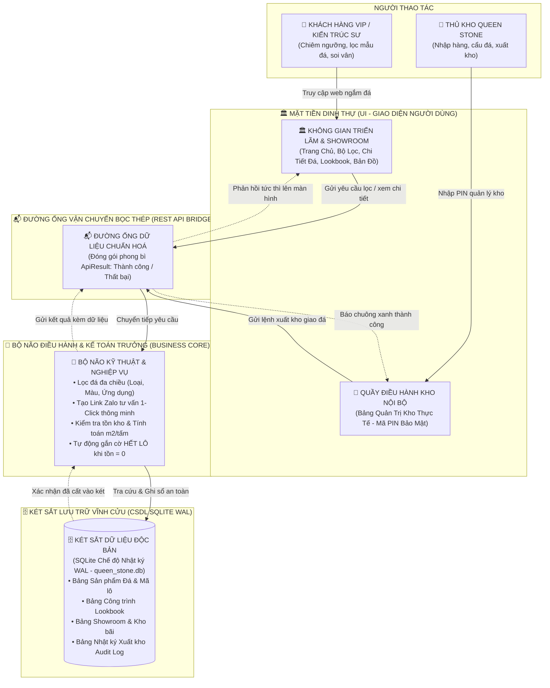
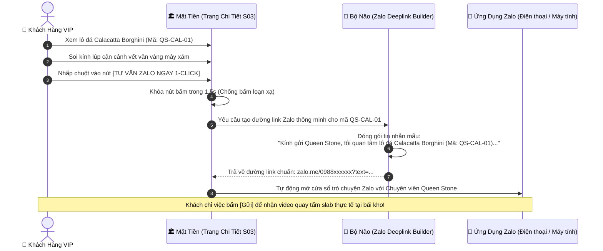
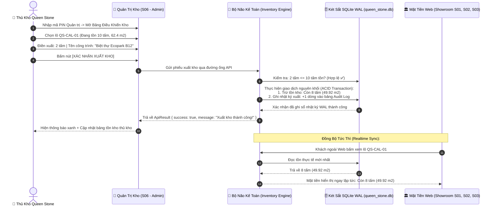
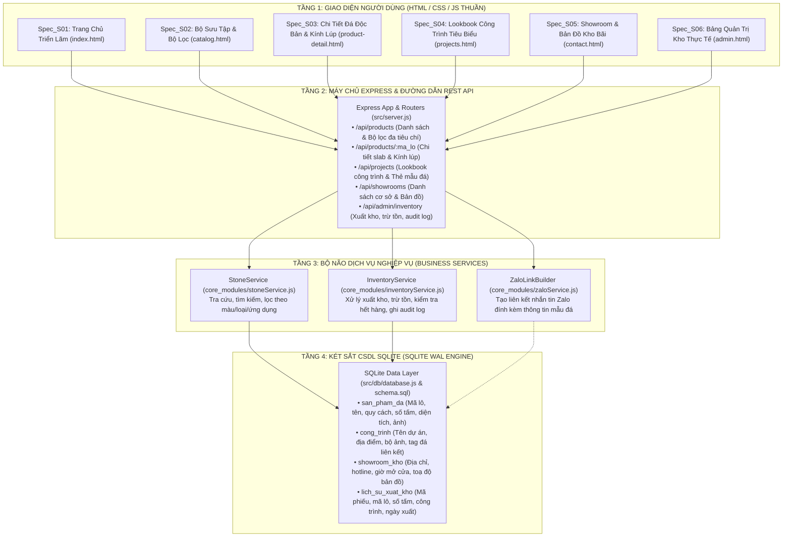

# BẢN VẼ KHÁI QUÁT KIẾN TRÚC & CƠ CHẾ VẬN HÀNH
*(Phong cách bình dân học vụ — Dành cho người không cần biết code)*
*Dự án: 03. LAB 03 - Web ban Da Tu Nhien*  
*Thương hiệu:* **Queen Stone** (Biểu tượng: Vương miện Hoàng gia)  
*Kiến trúc sư trưởng / Chủ dự án:* **Anh Mike (Mike Lam)**  
*Tổng thầu Thi công Kỹ thuật AI:* **Antigravity (Gemini)**  
*Loại ứng dụng (App Type):* `Web/Express` (Node.js + Express API + SQLite WAL + HTML/CSS/JS thuần)  
*Trạng thái hồ sơ:* `[ARCHITECTURE_LOCKED]` *(Chính thức phê duyệt bởi Anh Mike ngày 2026-09-08)*  
*Tham chiếu pháp lý:* [REQUIREMENTS.md](file:///c:/1.%20D%E1%BB%AE%20LI%E1%BB%86U/HOC%20VIBE%20CODING/6.%20LAB%2003%20-%20Web%20ban%20Da%20Tu%20Nhien/REQUIREMENTS.md) & Trọn bộ 6 bản Đặc tả [Spec_S01 đến Spec_S06](file:///c:/1.%20D%E1%BB%AE%20LI%E1%BB%86U/HOC%20VIBE%20CODING/6.%20LAB%2003%20-%20Web%20ban%20Da%20Tu%20Nhien/docs)

---

## 1. ẨN DỤ ĐỜI THỰC: HỆ THỐNG HOẠT ĐỘNG GIỐNG NHƯ THẾ NÀO?

Để Anh Mike dễ dàng hình dung toàn bộ hệ thống phần mềm mà không cần nhìn vào một dòng mã nguồn phức tạp nào, hãy tưởng tượng Web Queen Stone vận hành chính xác như một **"Tòa Dinh Thự Triển Lãm & Tổng Kho Đá Hoàng Gia"**:

### 4 Bộ Phận Cốt Lõi Trong Dinh Thự:

1. **🏛️ Mặt tiền Dinh Thự Triển Lãm (Giao diện Người dùng — Frontend Web):**
   - **Với Khách hàng VIP & Kiến trúc sư:** Là không gian bảo tàng đá lộng lẫy chuẩn phong cách *Bright Architectural Gallery & Royal Luxury*. Nền trắng cẩm thạch Calacatta, viền vàng Gold hoàng gia, logo vương miện Queen Stone. Khách ngắm toàn bộ tấm slab lớn, phóng to kính lúp vi mô soi từng tinh thể thạch anh, và bấm **Nút Zalo 1-Click** để kết nối ngay chuyên viên.
   - **Với Thủ kho Queen Stone:** Là cổng phụ bảo mật bằng mã PIN (`/admin`). Nơi thủ kho theo dõi lượng đá tồn thực tế ($m^2$ và số tấm) và bấm xuất kho chỉ với vài chạm trên điện thoại/máy tính bảng tại bãi đá.
   - *Nguyên tắc:* Mặt tiền chỉ tiếp nhận thao tác và làm nhiệm vụ đón tiếp, **không tự ý quyết định đúng sai hay tự ý sửa sổ sách**.

2. **📬 Đường ống vận chuyển bọc thép (Cầu nối REST API — Express Web Server):**
   - Là đường ống liên lạc hai chiều bằng khí nén siêu tốc nối từ mặt tiền quầy giao dịch vào phòng kế toán trung tâm.
   - Mọi thông tin đi qua đây bắt buộc đóng gói trong một chiếc "phong bì chuẩn" mang tên `ApiResult<T>`:
     - Luôn có dấu mộc `success: true` (Thành công) hoặc `success: false` (Thất bại).
     - Nếu có lỗi, luôn có **thông điệp tiếng Việt lịch sự** giải thích nguyên nhân rõ ràng (ví dụ: *"Số lượng xuất vượt quá tồn kho thực tế của lô này"*), tuyệt đối không để màn hình bị đơ hay báo lỗi mã kỹ thuật khó hiểu.

3. **🧠 Bộ não điều hành & Kế toán trưởng (Business Core Services):**
   - Nằm kín đáo bên trong hậu trường, nắm giữ toàn bộ luật chơi và quy tắc kinh doanh của Queen Stone:
     - **Tạo Link Zalo thông minh:** Tự động gom mã lô đá, tên đá, quy cách và đường link ảnh thực tế để khi khách bấm Zalo là nội dung đã soạn sẵn tinh tươm.
     - **Kiểm soát xuất kho:** Soát xét kỹ lưỡng: *Mã lô này còn trong kho không? Tồn 10 tấm mà đòi xuất 12 tấm thì kế toán chặn ngay lập tức.*
     - **Tự động gắn cờ "HẾT LÔ":** Khi số tấm tồn giảm về 0, bộ não lập tức đánh dấu lô đá đã bán hết, chuyển huy hiệu mặt tiền sang "ĐÃ HẾT LÔ" để nhân viên không tư vấn trùng lặp.
     - **Quy đổi tự động:** Tự động nhân chia diện tích ($m^2 = \text{Dài} \times \text{Rộng} \times \text{Số tấm} / 10.000$) chuẩn xác đến từng chữ số thập phân.

4. **🗄️ Két sắt lưu trữ vĩnh cửu (Cơ sở dữ liệu SQLite chế độ WAL):**
   - Chiếc két sắt nguyên khối mang tên `queen_stone.db` nằm an toàn tuyệt đối ngay trên ổ cứng máy chủ của Queen Stone.
   - Sử dụng cơ chế ghi nhật ký trước (**WAL — Write-Ahead Logging**): Giống như viên kế toán luôn ghi nhanh vào cuốn sổ tay nhật ký trước khi đóng dấu vào két sắt chính. Nếu có sự cố cúp điện đột ngột hoặc tắt máy, toàn bộ dữ liệu đã ghi sổ sẽ tự động phục hồi 100% nguyên vẹn khi bật lại máy.

---

## 2. CƠ CHẾ VẬN HÀNH THỰC TẾ TRÊN MÁY TÍNH CỦA ANH MIKE

| Câu hỏi thực tế của Anh Mike | Câu trả lời bình dân, dễ hiểu nhất |
|---|---|
| **Hệ thống này chạy ở đâu?** | Chạy dưới dạng **Ứng dụng Web Cục Bộ (Local Web Server)** bằng Node.js và Express. Hệ thống tự động phục vụ tại địa chỉ `http://localhost:3000` và có thể mở được trên mọi trình duyệt (Chrome, Cốc Cốc, Safari, Edge) của máy tính, iPad và điện thoại kết nối mạng nội bộ của bãi kho. |
| **Có cần mạng Internet để vận hành không?** | **100% KHÔNG CẦN INTERNET cho các tác vụ nội bộ!** Toàn bộ việc xem showroom, lọc sản phẩm, phóng to vân đá, tra cứu công trình và thao tác trừ tồn kho của thủ kho đều chạy mượt mà ngay cả khi rút dây mạng. Mạng Internet chỉ cần thiết duy nhất khi khách hàng bấm nút Zalo để chuyển hướng sang ứng dụng Zalo trên điện thoại. |
| **Dữ liệu và hình ảnh cất ở đâu?** | - Dữ liệu chữ số (Mã lô, kích thước, số lượng tồn, lịch sử xuất kho) cất trong đúng 1 file két sắt duy nhất: `data/queen_stone.db`. - Toàn bộ hình ảnh đá khổ lớn (ảnh toàn tấm slab, ảnh cận cảnh macro vein) cất gọn gàng trong thư mục hình ảnh tĩnh `public/images/`. Anh có thể sao chép thư mục dự án sang bất kỳ máy tính nào để sao lưu dự phòng trọn vẹn 100%. |
| **Làm sao để bật trang web lên?** | Anh Mike hoặc nhân viên chỉ cần **nhấp đúp chuột vào file `Chay_Ung_Dung.bat`** ngoài màn hình. Máy chủ tự động khởi động và tự động mở trình duyệt web lên trong vòng 1.5 giây. Không cần gõ bất kỳ câu lệnh lập trình nào! |
| **Web có bị giật lag khi tải ảnh đá lớn không?** | **KHÔNG.** Hệ thống áp dụng cơ chế tải ảnh lười biếng thông minh (*Lazy Loading*) và nén bộ nhớ đệm (*Browser Cache*). Trình duyệt chỉ nạp các ảnh đang cuộn tới trước mắt, giúp trang web luôn nhẹ nhàng, cuộn mượt 60fps và tiêu tốn cực ít bộ nhớ RAM máy tính. |

---

## 3. VÒNG ĐỜI 2 THAO TÁC CỐT LÕI (LUỒNG DỮ LIỆU ĐỜI THƯỜNG)

### 🔹 Luồng A: Khách Hàng VIP Xem Đá Calacatta Và Bấm "Tư Vấn Zalo 1-Click"

1. **Khách hàng thưởng lãm:** Khách VIP mở trang chi tiết lô đá `QS-CAL-01`, xem ảnh toàn tấm slab và lướt kính lúp soi từng hạt vân đá tự nhiên.
2. **Khách bấm nút Zalo:** Mặt tiền lập tức kích hoạt cơ chế hãm (*Debounce*), không cho bấm trùng lặp 2 lần.
3. **Bộ não đóng gói thông tin:** Bộ não tự động gom mã lô `QS-CAL-01`, tên đá `Calacatta Borghini`, kích thước `320 x 195 cm` và link ảnh đại diện vào một bức điện tín.
4. **Mở kết nối trực tiếp:** Trình duyệt tự động mở ứng dụng Zalo (hoặc Zalo Web), kết nối thẳng tới số Hotline chuyên viên Queen Stone với toàn bộ nội dung đã điền sẵn, khách hàng không cần phải gõ lại mã đá thủ công.

---

### 🔹 Luồng B: Thủ Kho Xuất Kho 2 Tấm Đá Giao Công Trình $\rightarrow$ Cập Nhật Tồn Tức Thì Ra Mặt Tiền Web

1. **Thủ kho xác thực:** Thủ kho nhập Mã PIN bảo mật để mở giao diện quản trị kho tại bãi.
2. **Thực hiện xuất kho:** Khi xe cẩu bốc 2 tấm đá lên xe tải giao cho công trình, thủ kho chọn lô `QS-CAL-01`, nhập số lượng `2` tấm và ghi chú công trình `Biệt thự Ecopark B12`.
3. **Bộ não kiểm tra & Ghi sổ kép:**
   - Bộ não đối chiếu: Số lượng xuất 2 tấm $\le$ 10 tấm đang tồn $\rightarrow$ Cho phép xuất.
   - Mở két SQLite thực hiện một **Giao dịch Nguyên khối (Transaction)**: Giảm số tấm tồn từ 10 xuống 8, giảm diện tích từ $62.4 m^2$ xuống $49.92 m^2$, đồng thời ghi ngay một dòng lịch sử vào sổ cái `lich_su_xuat_kho` để đối soát cuối tháng.
4. **Đồng bộ tức thì ra mặt tiền Web:** Ngay khi két sắt đóng lại, toàn bộ API của hệ thống lập tức trả về số liệu mới. Khách hàng hoặc chuyên viên tư vấn ngoài Web khi xem sản phẩm sẽ thấy số lượng tồn cập nhật ngay lập tức thành **8 tấm ($49.92 m^2$)**. Nếu số tấm giảm về 0, huy hiệu mặt tiền lập tức tự chuyển thành **"ĐÃ HẾT LÔ"** mà không cần khởi động lại ứng dụng.

---

## 4. BẢN ĐỒ CẤU TRÚC HỆ THỐNG & ÁNH XẠ 6 MÀN HÌNH SPEC

Hệ thống được tổ chức mạch lạc thành 4 tầng kỹ thuật, ánh xạ trực tiếp từ 6 bản đặc tả đã được Anh Mike phê duyệt:

### Bảng Đối Chiếu 6 Màn Hình Với Thành Phần Kỹ Thuật

| Mã Spec | Tên Màn Hình & Trách Nhiệm | Tệp Giao Diện (UI) | API Endpoint Phục Vụ | Bảng Dữ Liệu Tương Ứng |
|---|---|---|---|---|
| **Spec_S01** | Trang Chủ Triển Lãm Hoàng Gia | `public/index.html` | `GET /api/products/featured` `GET /api/projects/highlight` | `san_pham_da` `cong_trinh` |
| **Spec_S02** | Danh Mục Bộ Sưu Tập & Bộ Lọc | `public/catalog.html` | `GET /api/products?loai=...&mau=...` | `san_pham_da` |
| **Spec_S03** | Chi Tiết Đá Độc Bản & Kính Lúp | `public/product-detail.html` | `GET /api/products/:ma_lo` `GET /api/zalo-link/:ma_lo` | `san_pham_da` |
| **Spec_S04** | Triển Lãm Dự Án & Lookbook | `public/projects.html` | `GET /api/projects` `GET /api/projects/:id` | `cong_trinh` `cong_trinh_da` |
| **Spec_S05** | Hệ Thống Showroom, Kho Bãi & Bản Đồ | `public/contact.html` | `GET /api/showrooms` | `showroom_kho` |
| **Spec_S06** | Bảng Điều Khiển Quản Trị Kho Thực Tế | `public/admin.html` | `POST /api/admin/auth/pin` `POST /api/admin/inventory/deduct` `GET /api/admin/inventory/logs` | `san_pham_da` `lich_su_xuat_kho` |

---

## 5. BẢO VỆ 3 LỚP "THÉP" ĐẢM BẢO HỆ THỐNG KHÔNG BAO GIỜ TREO

Hệ thống được thiết kế theo các tiêu chuẩn kỹ nghệ vững chắc để đảm bảo hoạt động trơn tru 24/7 mà không gặp sự cố:

1. **Lớp 1 — Bảo Vệ Két Dữ Liệu (SQLite WAL Mode & ACID Transaction):**
   - Kích hoạt chế độ `PRAGMA journal_mode = WAL;` (Write-Ahead Logging). Cơ chế này cho phép người dùng ngoài Web xem và tra cứu dữ liệu thoải mái mà **không bao giờ bị khóa bảng** ngay cả khi thủ kho đang bấm nút xuất hàng trăm mét vuông đá.
   - Thao tác xuất kho được bọc kín trong một khối `Transaction`: Hoặc là cả việc trừ tồn kho và ghi nhật ký audit log đều thành công trọn vẹn, hoặc là hủy bỏ nếu có lỗi — **tuyệt đối không bao giờ xảy ra tình trạng trừ nhầm hay âm tồn kho**.

2. **Lớp 2 — Bộ Hãm Xung Nhịp (Debounce 1.5s & Lazy Loading):**
   - Trên mọi nút bấm quan trọng (Bấm mở Zalo, Bấm xác nhận xuất kho, Bấm lọc danh mục), hệ thống tự động khóa nút trong 1.5 giây sau khi nhấn để ngăn chặn việc người dùng vô tình nhấp chuột nhiều lần liên tiếp gây trùng lặp giao dịch.
   - Bộ hình ảnh toàn tấm slab và vân đá macro được trang bị cơ chế tải ảnh khi cuộn tới (*Lazy Loading*), giúp tối ưu hóa bộ nhớ máy tính, giữ mức chiếm dụng RAM của toàn bộ ứng dụng luôn dưới **100MB**.

3. **Lớp 3 — Bảo Vệ Cửa Ngõ & Giữ Kín Bí Mật (PIN Security & Environment Protection):**
   - Phân hệ quản trị kho bãi (`/admin`) được bảo vệ bằng **Mã PIN Quản Trị (Admin PIN)** được kiểm tra chặt chẽ phía máy chủ. Người lạ ngoài Web không thể tùy tiện bấm nút trừ tồn đá trong kho.
   - Toàn bộ các tham số nhạy cảm (Số điện thoại Hotline, Mã PIN Quản trị, Số Zalo tiếp nhận, Cổng kết nối) đều được cất giữ trong tệp phong bì kín `.env`, tuyệt đối không bao giờ viết thẳng vào mã nguồn hay đưa lên mạng.

---

## 6. TỪ ĐIỂN THUẬT NGỮ "BÌNH DÂN HỌC VỤ"

Dành cho Anh Mike và mọi nhân sự trong công ty tra cứu nhanh chóng mà không cần có kiến thức lập trình:

| Thuật ngữ kỹ thuật | Tên gọi đời thường | Giải thích ý nghĩa bằng ngôn ngữ bình dân |
|---|---|---|
| **Web/Express** | *Cửa hàng Web tự hành* | Một máy chủ nhỏ gọn viết bằng Node.js giúp hiển thị trang web lên trình duyệt máy tính mà không cần cài đặt phần mềm cồng kềnh. |
| **SQLite WAL** | *Két sắt ghi sổ nhật ký* | Một phần mềm cơ sở dữ liệu siêu bền gói gọn trong đúng 1 file duy nhất trên máy tính, chạy cực nhanh và không bao giờ mất dữ liệu khi mất điện. |
| **ApiResult** | *Phong bì thư chuẩn* | Quy cách đóng gói câu trả lời của máy chủ: Luôn báo rõ ràng việc thực hiện là Thành công hay Thất bại kèm lời giải thích bằng tiếng Việt. |
| **Tấm Slab Đá** | *Phiến đá nguyên khối* | Tấm đá tự nhiên khổ lớn nguyên bản vừa được xẻ từ vỉa núi tự nhiên (kích thước thông thường khoảng $320 \times 195 \text{ cm}$). |
| **Vân Đá Macro** | *Ảnh vân cận cảnh* | Góc chụp siêu gần sát bề mặt phiến đá, giúp khách hàng nhìn thấy rõ các tinh thể thạch anh và đường chỉ vân tự nhiên. |
| **Bookmatch** | *Ghép vân đối xứng* | Kỹ thuật xẻ và xếp 2 hoặc 4 tấm đá liền kề sao cho đường vân mở ra đối xứng như một trang sách mở, tạo thành bức tranh đá tự nhiên tráng lệ. |
| **Zalo Deep Link** | *Đường dẫn mở chat Zalo 1-Click* | Một liên kết thông minh giúp mở thẳng ứng dụng Zalo trên máy người dùng kèm theo nội dung tin nhắn và mã lô đá đã soạn sẵn. |
| **Realtime Inventory** | *Tồn kho tức thì* | Cơ chế đồng bộ không độ trễ: Khi thủ kho vừa bấm xuất đá tại bãi, số lượng hiển thị trên trang web lập tức giảm ngay, không cần tải lại máy chủ. |
| **Debounce** | *Bộ hãm nút bấm* | Cơ chế chống bấm chuột liên thanh: Người dùng click 5 lần trong 1 giây thì hệ thống chỉ nhận đúng 1 lần đầu tiên. |
| **Zero-State** | *Nhà mới dọn về* | Trạng thái trang web khi kho mới tinh chưa nhập lô đá nào, hiển thị lời chào và hướng dẫn nhập lô đá đầu tiên một cách thân thiện. |

---

## 7. BIÊN BẢN PHÊ DUYỆT CỦA KIẾN TRÚC SƯ TRƯỞNG

Hồ sơ Bản vẽ Kiến trúc Bình dân này đã hoàn tất đầy đủ 100% các nội dung theo chuẩn Vibe Coding Framework v5.0, sẵn sàng làm cơ sở để tiến hành Chặng 4 (Thiết kế Giao diện Stitch MCP & Khóa Giao diện):

- [ ] **Anh Mike đã duyệt bản vẽ kiến trúc này ngày:** 2026-09-08  
- [ ] **Trạng thái phê duyệt:** `[ARCHITECTURE_LOCKED]`  
- [ ] **Bước kế tiếp:** Kích hoạt Chặng 4 — Kết nối Stitch MCP để thiết kế giao diện ràng buộc theo đúng đặc tả 6 bản Spec.
